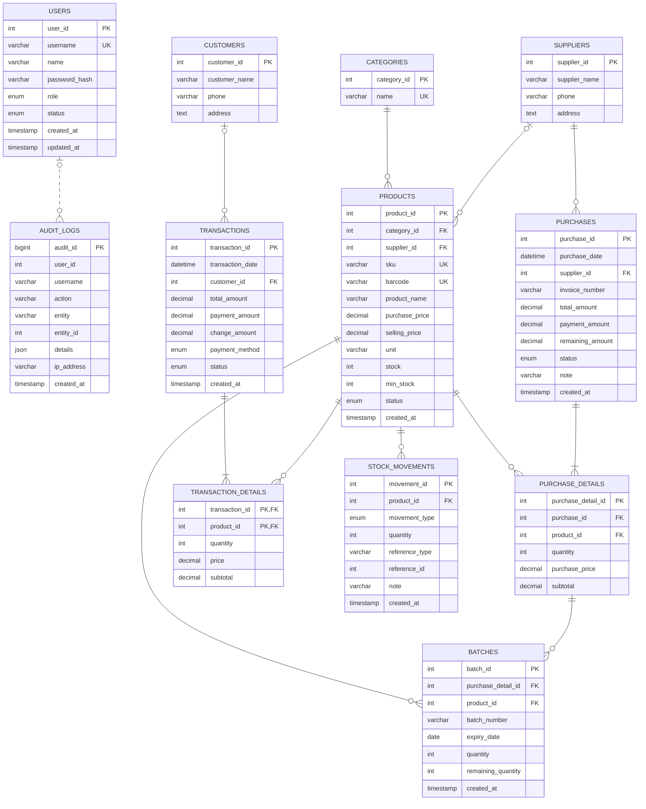

# Entity Relationship Diagram BEKUKU


## ERD Relasional



## Ringkasan Relasi

| Parent | Child | Kardinalitas | Aturan |
|---|---|---:|---|
| `categories` | `products` | 1 : N | Produk wajib memiliki kategori. Kategori tidak dapat dihapus jika masih digunakan. |
| `suppliers` | `products` | 1 : N | Supplier produk bersifat opsional. Jika supplier dihapus, `supplier_id` produk menjadi `NULL`. |
| `suppliers` | `purchases` | 1 : N | Setiap pembelian wajib memiliki supplier. Supplier tidak dapat dihapus jika memiliki pembelian. |
| `purchases` | `purchase_details` | 1 : N | Detail terhapus otomatis saat header pembelian dihapus. |
| `products` | `purchase_details` | 1 : N | Produk yang pernah dibeli tidak dapat dihapus melalui relasi ini. |
| `purchase_details` | `batches` | 1 : N | Satu detail pembelian dapat menghasilkan satu atau beberapa batch. |
| `products` | `batches` | 1 : N | Batch selalu terkait dengan produk yang sama. |
| `customers` | `transactions` | 1 : N | Customer pada transaksi bersifat opsional; penghapusan customer mengosongkan `customer_id`. |
| `transactions` | `transaction_details` | 1 : N | Detail terhapus otomatis saat transaksi dihapus. |
| `products` | `transaction_details` | 1 : N | Detail penjualan menyimpan harga saat transaksi, sehingga perubahan harga produk tidak mengubah histori. |
| `products` | `stock_movements` | 1 : N | Semua pergerakan stok terhubung ke produk. |
| `users` | `audit_logs` | 1 : N (logis) | `audit_logs.user_id` bersifat nullable dan tidak memiliki foreign key database agar log tetap tersimpan setelah user dihapus/nonaktif. |

## Kamus Data dan Aturan

### Master data

- **`categories`** menyimpan kelompok produk. `name` unik.
- **`suppliers`** menyimpan pihak pemasok dan dapat dipakai pada produk maupun pembelian.
- **`customers`** menyimpan customer. Customer boleh tidak dipilih untuk transaksi umum.
- **`products`** menyimpan katalog dan harga. `sku` serta `barcode` unik bila diisi.
- **`users`** menyimpan akun aplikasi dengan role `admin`, `kasir`, atau `gudang`.

### Pembelian dan batch

- **`purchases`** adalah header pembelian dan menyimpan nilai pembayaran serta sisa hutang.
- **`purchase_details`** adalah item pembelian. `subtotal` secara bisnis adalah
  `quantity * purchase_price`.
- **`batches`** menyimpan stok berdasarkan tanggal kedaluwarsa. `quantity` adalah
  jumlah awal, sedangkan `remaining_quantity` adalah jumlah yang masih tersedia.
- Stok batch yang tersedia dihitung dari total `batches.remaining_quantity` per produk
  dan disinkronkan ke `products.stock`.
- FEFO memilih batch dengan `expiry_date` paling awal ketika transaksi mengurangi stok.

### Penjualan dan pembayaran

- **`transactions`** adalah header penjualan dengan metode `cash`, `transfer`,
  `qris`, atau `qris_image`.
- **`transaction_details`** memakai primary key gabungan
  (`transaction_id`, `product_id`), sehingga satu produk hanya muncul sekali dalam
  satu transaksi. `subtotal` adalah `quantity * price`.
- Pembayaran disimpan langsung pada header transaksi; tidak ada tabel `payments`
  terpisah pada skema saat ini.
- Status transaksi `selesai` atau `batal`. Pembatalan harus diperlakukan sebagai
  perubahan status, bukan menghapus histori transaksi.

### Stok, referensi, dan audit

- **`stock_movements`** mencatat `masuk` dan `keluar` untuk histori perubahan stok.
- `reference_type` dan `reference_id` pada `stock_movements` adalah referensi
  polimorfik (misalnya `purchase` atau `transaction`), sehingga tidak memiliki
  foreign key database langsung.
- **`audit_logs`** menyimpan aktivitas pengguna. `entity` dan `entity_id` juga
  merupakan referensi polimorfik ke data yang dicatat, bukan foreign key langsung.
- Kolom `username` pada audit adalah snapshot username saat kejadian, sehingga log
  tetap informatif walaupun data user berubah.

## Alur Data Utama

```text
SUPPLIERS
    |
    v
PURCHASES -> PURCHASE_DETAILS -> BATCHES -> PRODUCTS
                                      |
                                      v
                              STOCK_MOVEMENTS
                                      ^
                                      |
CUSTOMERS -> TRANSACTIONS -> TRANSACTION_DETAILS
```

1. Supplier dicatat pada `purchases`.
2. Item pembelian dicatat pada `purchase_details`.
3. Item tersebut menghasilkan `batches` dengan tanggal kedaluwarsa dan stok awal.
4. Stok masuk dicatat pada `stock_movements`.
5. Penjualan dicatat pada `transactions` dan `transaction_details`.
6. Sistem menerapkan FEFO, mengurangi `batches.remaining_quantity`, memperbarui
   `products.stock`, lalu mencatat stok keluar.

## Catatan Implementasi

- Garis penuh pada diagram menunjukkan foreign key yang didefinisikan pada SQL;
  garis putus-putus menunjukkan relasi logis tanpa foreign key database.
- `users` dan `audit_logs` tersedia melalui migration keamanan dan sudah termasuk
  dalam ERD.
- `qris_image` adalah nilai tambahan pada enum `transactions.payment_method`;
  bukan tabel baru.
